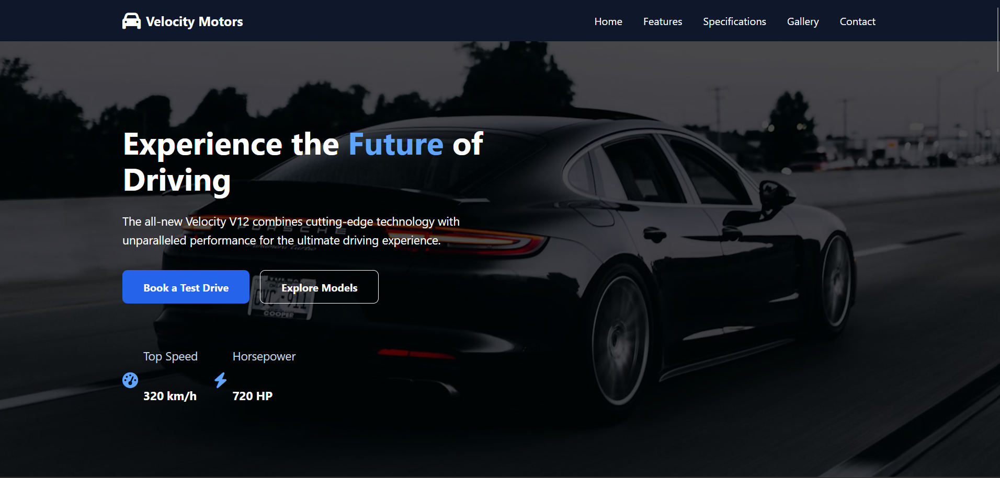
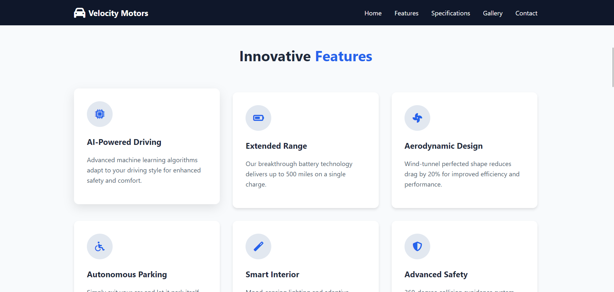
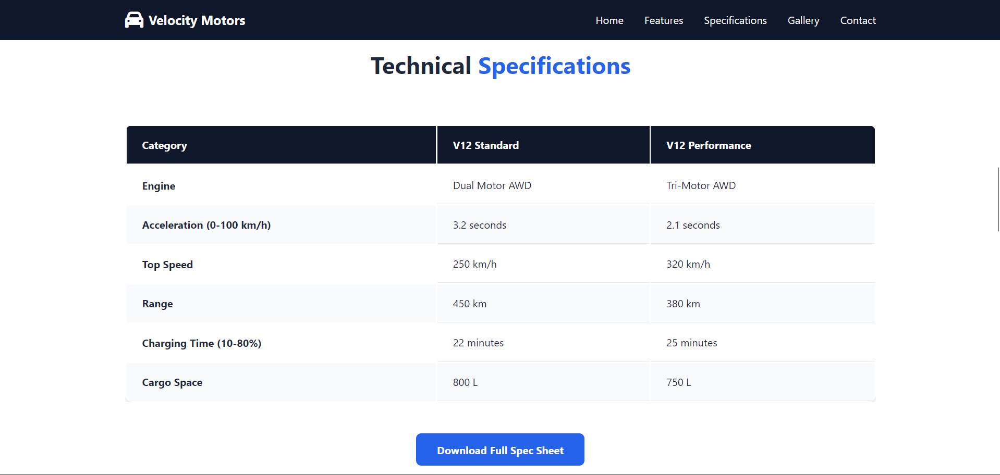
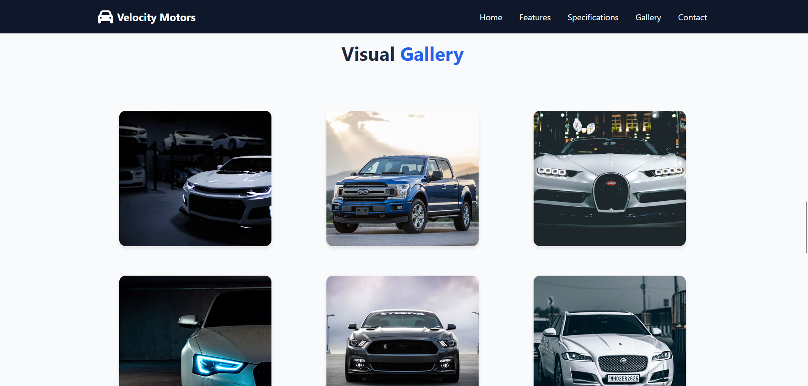
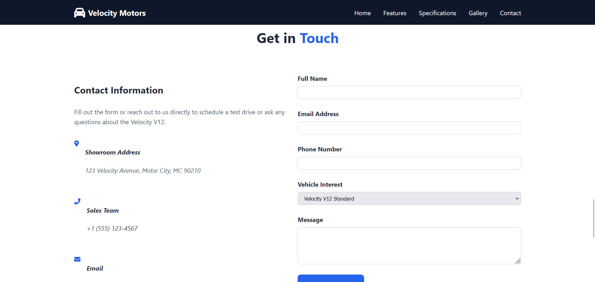

# Velocity Motors — Next Generation Driving

A modern, responsive landing page for **Velocity Motors**, showcasing the fictional Velocity V12 through performance specifications, innovative features, a visual gallery, and a contact form.

## Overview

The Velocity Motors landing page is designed to present a premium automotive brand with a clean, modern, and performance-focused interface.

The page includes:

- Responsive navigation
- Hero section with vehicle performance highlights
- Innovative features section
- Technical specifications comparison
- Vehicle gallery
- Contact and test-drive form
- Social media links
- Responsive footer
- Back-to-top button
- Accessible focus states
- Reduced-motion support
- Mobile navigation

## Technologies Used

- **HTML5** — Semantic page structure
- **CSS3** — Styling, responsive layouts, animations, and transitions
- **JavaScript** — Interactive functionality
- **Font Awesome 6.4.0** — Icons
- **CSS Grid & Flexbox** — Responsive layouts
- **Responsive Design** — Mobile, tablet, and desktop support

## Project Structure

velocity-motors/
│
├── index.html
├── style.css
├── script.js
│
├── images/
│   ├── car.jpg
│   ├── photo-1492144534655-ae79c964c9d7.jpg
│   ├── photo-1551830820-330a71b99659.jpg
│   ├── photo-1544636331-e26879cd4d9b.jpg
│   ├── photo-1542282088-fe8426682b8f.jpg
│   ├── photo-1494976388531-d1058494cdd8.jpg
│   └── pexels-thekameragrapher-33253286.jpg
│
└── screenshots/
    ├── home.png
    ├── features.png
    ├── specifications.png
    ├── gallery.png
    ├── contact.png

> The README intentionally contains no image previews.

## Live Demo

[**View Live Demo →**](https://velocity-motors-page.netlify.app/)

## Screenshots

### Home / Hero Section

### Innovative Features

### Technical Specifications

### Vehicle Gallery

### Contact Section

## Sections

### 1. Navigation

The fixed navigation bar provides quick access to:

- Home
- Features
- Specifications
- Gallery
- Contact

A mobile navigation menu is provided for smaller screens.

### 2. Hero Section

The hero section introduces the Velocity V12 with the headline:

> Experience the Future of Driving

It highlights key performance figures:

- **Top Speed:** 320 km/h
- **Horsepower:** 720 HP

It also includes calls to action for booking a test drive and exploring models.

### 3. Innovative Features

Six feature cards highlight the vehicle's technology:

- AI-Powered Driving
- Extended Range
- Aerodynamic Design
- Autonomous Parking
- Smart Interior
- Advanced Safety

### 4. Technical Specifications

The specifications section compares two versions of the Velocity V12:

| Specification     | V12 Standard   | V12 Performance |
| ----------------- | -------------- | --------------- |
| Engine            | Dual Motor AWD | Tri-Motor AWD   |
| 0–100 km/h        | 3.2 seconds    | 2.1 seconds     |
| Top Speed         | 250 km/h       | 320 km/h        |
| Range             | 450 km         | 380 km          |
| Charging (10–80%) | 22 minutes     | 25 minutes      |
| Cargo Space       | 800 L          | 750 L           |

### 5. Gallery

The gallery provides a responsive grid for displaying vehicle photography, including exterior, interior, dashboard, headlights, side-view, and wheel imagery.

### 6. Contact

The contact section contains:

- Showroom information
- Sales phone number
- Sales email
- Vehicle-interest selector
- Customer message form
- Social media links

The form collects:

- Full name
- Email address
- Phone number
- Vehicle interest
- Message

## Responsive Design

The layout adapts to different screen sizes using CSS media queries.

### Mobile

- Mobile navigation menu
- Single-column feature layout
- Single-column gallery
- Stacked contact section
- Stacked hero buttons

### Tablet

- Two-column feature grid
- Two-column gallery
- Three-column footer links

### Desktop

- Full desktop navigation
- Three-column feature grid
- Three-column gallery
- Two-column contact layout
- Horizontal footer layout

## Accessibility

The page includes several accessibility considerations:

- Semantic HTML elements
- Descriptive image alt attributes
- ARIA labels for navigation and buttons
- Keyboard focus states using \:focus-visible
- Hidden table caption for screen readers
- Proper form labels
- aria-expanded and aria-controls for mobile navigation
- Reduced-motion support using prefers-reduced-motion

## Color Palette

The design uses a blue-and-slate color scheme.

| Variable  | Color   |
| --------- | ------- |
| Primary   | #2563eb |
| Secondary | #1e40af |
| White     | #ffffff |
| Gray 50   | #f8fafc |
| Gray 200  | #e2e8f0 |
| Gray 300  | #cbd5e1 |
| Gray 400  | #94a3b8 |
| Gray 600  | #475569 |
| Gray 700  | #334155 |
| Gray 800  | #1e293b |
| Gray 900  | #0f172a |

## Getting Started

### 1. Clone or download the project

Download the project files to your local machine.

### 2. Keep the project structure intact

Make sure index.html, style.css, script.js, and the required assets are located in their expected directories.

### 3. Open the page

Open index.html in a modern web browser.

For development, you can also use a local development server such as VS Code Live Server.

## Customization

You can easily customize the landing page by modifying:

### Brand

Update the Velocity Motors name and logo inside index.html.

### Colors

Change the CSS variables at the beginning of style.css:

\:root {
\--primary: #2563eb;
\--secondary: #1e40af;
}

### Vehicle Information

Update the hero statistics, feature descriptions, and specification table directly in index.html.

### Contact Information

Replace the showroom address, phone number, email address, and social links with your real business information.

### Images

Replace the files in the images/ directory with your own vehicle photography while keeping the corresponding paths in index.html.

## Browser Support

The page is designed for modern browsers that support:

- HTML5
- CSS Grid
- CSS Flexbox
- CSS Custom Properties
- CSS Media Queries
- \:focus-visible
- prefers-reduced-motion

## Future Improvements

Potential enhancements include:

- Functional test-drive booking
- Working contact-form backend
- Vehicle model selection
- Interactive vehicle configurator
- Lightbox gallery
- Customer testimonials
- Pricing section
- Newsletter subscription
- Dark/light theme switcher
- SEO metadata and Open Graph tags
- Form validation and success notifications

## License

This project is intended as a landing-page/demo project. Add an appropriate license before distributing or using it commercially.

## Credits

Built as a modern automotive landing-page concept for **Velocity Motors**.

Icons are provided through **Font Awesome**.
